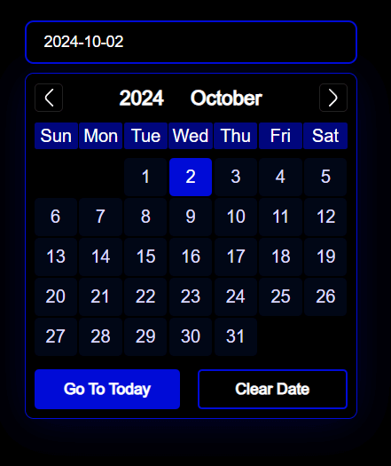
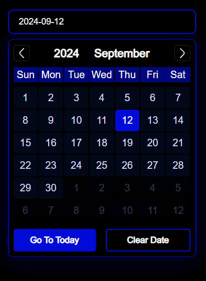
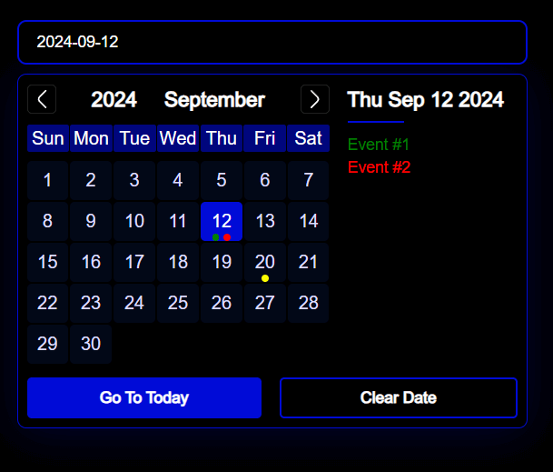
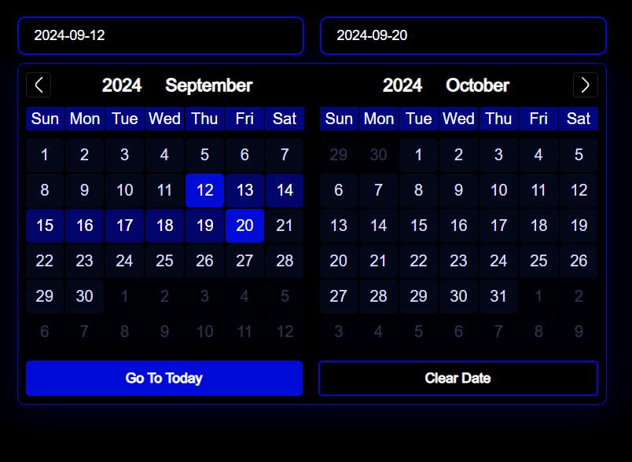
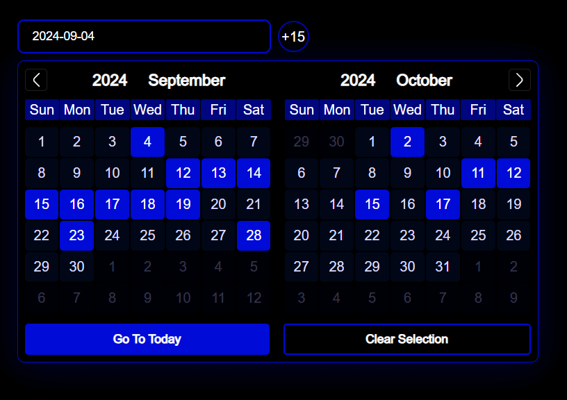
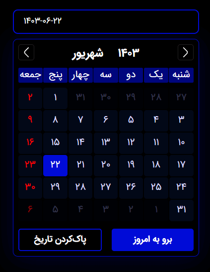
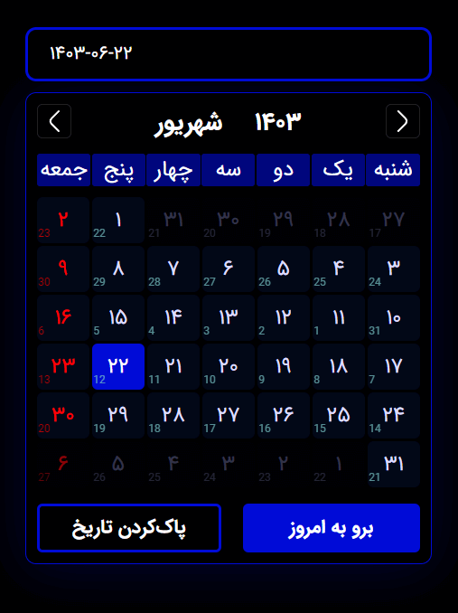

# drm-datepickerjs

<div style="display:flex; gap: 4px;">

  <a href="https://www.npmjs.com/package/drm-datepickerjs">
    
  </a>

  <a href="https://www.npmjs.com/package/drm-datepickerjs">
    
  </a>

  <a href="https://www.npmjs.com/package/typescript">
    
  </a>

  <a href="https://www.npmjs.com/package/drm-datepickerjs">
    
  </a>

  <a href="https://www.npmjs.com/package/drm-datepickerjs">
    
  </a>

</div>

<br>

<table>
  <thead>
    <tr>
      <th>DatePicker - `space`</th>
      <th>DatePicker - `fll`</th>
      <th>DatePicker With Custom Event</th>
      <th>RangePicker - `twoSide`</th>
      <th>Multi-Select</th>
      <th>DatePicker - Localization</th>
      <th>DatePicker - Localization with Gregorian As Secondary</th>
    </tr>
  </thead>
  <tbody>
    <tr>
      <td></td>
      <td></td>
      <td></td>
      <td></td>
      <td></td>
      <td></td>
      <td></td>
  </tr>
  </tbody>
</table>

An headless, event-base, picker for Javascript project, with customization and localization support. This package provides your core functionality to create any picker your want, it does't matter which design system you use for UI and how much you need customization. <br>
This package provides you with 3 different of pickers

- DatePicker
  - used for simple date selection like birthday
- RangePicker
  - used to select a range of date
- MultiSelectPicker
  - used to randomly select dates (also range selection and de-selection is available)

## Introduction

This package created in order to work regardless which tool you use, for example it doesn't matter you use a style system or write your style in pure css, it doesn't matter you use one of the existing JS framework or use a custom framework that you created by your own, still possible to use this package, also if you using `pure js` it's possible to use CDN ([check this](./markdown//usage.md#using-cdn)), even possible to use require instead of import (.cjs file included).
<br>

With this package you can add your localization easily, and it's up to you to determine the switch condition. [doc](./markdown/localization.md)
<br>

This package use JS `new Date()` to create dates and stores date based on gregorian calendar, this gives you more flexibility for example you can show one calendar as your primary calendar and show others calendar by only create a helper function that convert gregorian date to your target calendar, passing date to this converter gives you converted date, then you can do whatever you want with this date.

<br>
A picker is a JS class, and if you want you can add more functionality (just create a class, extends form one of the pickers and add your functionality).
<br><br>

**_Because of headless design you can use this package to create calendars too._**

## Features

- Headless UI
- Framework/library independent
- Easy localization
- Event base Picker
- Support `leap` year
- Zero dependency
- `Low bundle size` (less than 5KB)
- Supports Type (the entire package written with Typescript)
- Available Pickers: `DatePicker`, `RangePicker`, `MultiSelectPicker`

You can create your `custom event` and show it anywhere you want [check this](./markdown/customization.md#custom-event), <br>
Also with MultiSelectPicker you can select range of dates by holding `ctrlKey`, and de-select dates by holding `shiftKey`. [see customization for more info](./markdown/customization.md#multiselectpicker-range-selection)

## Notes

- make sure the picker instance remain the same on each renders.

## Installation

```bash
npm i drm-datepickerjs
```

```bash
yarn add drm-datepickerjs
```

```bash
pnpm i drm-datepickerjs
```

## Documentation Links

There is more to this package recommend to read following documentations.

- [Full Documentation](./docs/index.md)
- [Customization and default options](./markdown/customization.md)
- [Localization](./markdown/localization.md)
- [Complexity](./markdown/complexity.md)
- [Dive Deep](./markdown/diveDeep.md)
- [Usage](./markdown/usage.md)
- [Examples](./examples/examples.md)
